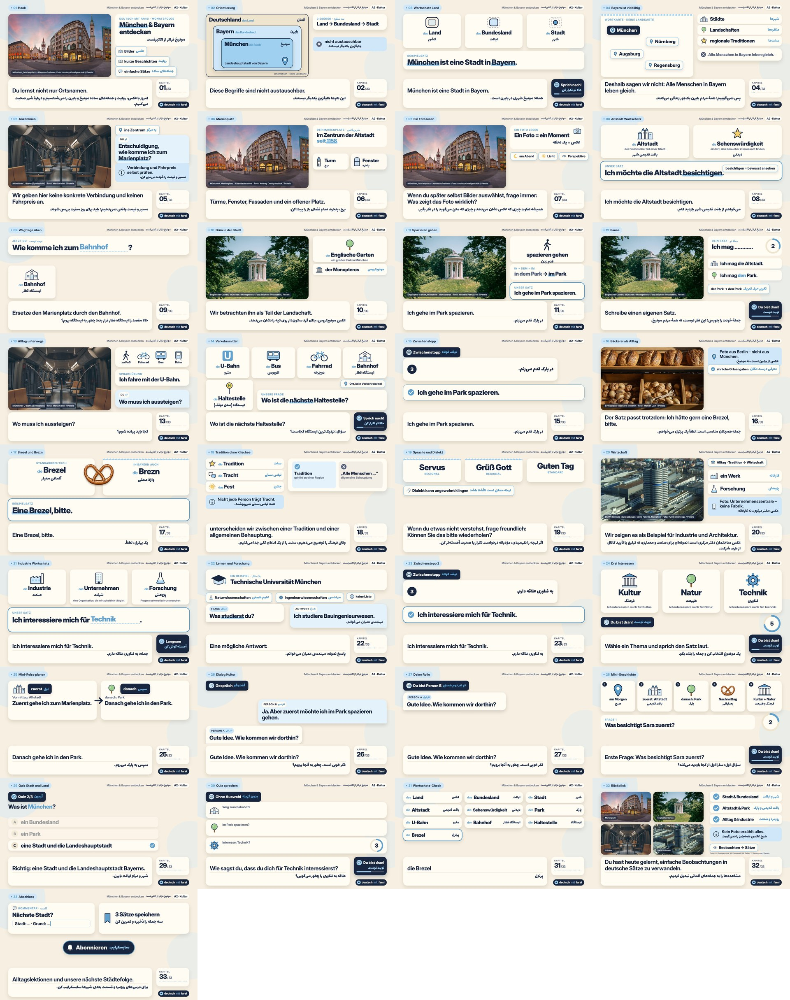

# QC-Bericht – München & Bayern entdecken (monthly)

Automatisch erzeugt von `scripts/qc.py` aus `out/final.mp4` (md5 `c016be45665389c223bd3655169e65dd`, 378.5 MB).

## Technik

| Prüfpunkt | Soll | Ist | OK |
|---|---|---|---|
| Auflösung | 1920×1080 | 1920×1080 | ✅ |
| Bildrate | 30 fps | 30/1 | ✅ |
| Dauer | 18:15 (±10 % = 16:25–20:05) | 16:33.05 | ✅ |
| Video-Codec | H.264 High, yuv420p, CRF 17–19 | h264 High, yuv420p, CRF 18 | ✅ |
| Audio-Codec | AAC 256k, 48 kHz Stereo | aac 256k, 48000 Hz, 2 ch | ✅ |
| +faststart (moov vorne) | ja | ja | ✅ |
| Lautheit integriert | −14 … −16 LUFS | -15.1 LUFS (LRA 2.9 LU) | ✅ |
| True Peak | ≤ −1.5 dBTP | -1.9 dBTP | ✅ |
| Musik unter Sprache | 14–18 dB leiser | 15.7 dB (Stimme -15.9 / Musik -31.6 LUFS) | ✅ |
| Ducking | 150 ms Attack / 400 ms Release | wie Soll (one-pole, `audio/mix.py`) | ✅ |
| Fotoanteil | 25–40 % der Bildzeit | 27 % | ✅ |

## Sprache und Didaktik

- Stimme: Piper TTS `de-thorsten-low` (männlich, 16 kHz → 48 kHz). Erklärtempo length_scale 1.12, Lernsätze 1.15 → langsame Wiederholung 1.6 → 4 s Nachsprechpause.
- Langsame Wiederholungen: 12 (alle 12 Sätze aus `LEARNING_CUES.json`, je einmal an der passenden Lehrszene), erfasst in `voice_manifest.json`.
- Antwortpausen mit Countdown: 22 (Wegfrage, eigener Satz, Interessen, 2 Zwischenstopps, Rollenspiel, Mini-Geschichte, 2 Quiz-Szenen; 5–6 s).
- Jahreszahl 1158 wird als „elfhundertachtundfünfzig“ gesprochen und als „1158“ angezeigt. TTS-Eingaben mit arabischer Schrift: 0.
- Sprecherbezeichnungen („Besucher“, „Person A/B“) werden als Beschriftung gezeigt, nicht gesprochen.
- Der Übungsdialog hat einen zweiten Durchlauf mit 5 s Antwortpause und anschließender Musterantwort (Szene „Deine Rolle“).
- Untertitel: `de.srt` (274 Einträge) und `fa.srt` (194 Einträge) aus gemessenen Audio-Zeitmarken.

## RTL / Persisch

- Schrift Lalezar (OFL) aus der Master-Vorlage; Formung und Bidi durch Chromium (HarfBuzz), `direction: rtl` für alle persischen Blöcke; gemischte Zeilen (z. B. «Zum Mitnehmen» یعنی …) visuell geprüft.
- ZWNJ (U+200C) in den Übersetzungen erhalten: 132 Vorkommen (z. B. می‌خواهم, بیرون‌بر, همین‌جا).
- `fa.srt` mit RLE/PDF-Steuerzeichen um jede Zeile, damit Player mit LTR-Standard korrekt darstellen.
- Ergänzte persische Übersetzungen (im Paket nicht 1:1 vorhanden, für Satzgleichheit ergänzt, bitte gegenlesen):
  - monthly_01: „Du lernst auch, wie du über eine Stadt sprechen und nach dem Weg fragen kannst.“ → یاد می‌گیری دربارهٔ یک شهر حرف بزنی و مسیر را بپرسی.
  - monthly_02: „Wenn jemand in München wohnt, wohnt diese Person auch in Bayern und in Deutschland.“ → کسی که در مونیخ زندگی می‌کند، در بایرن و آلمان هم زندگی می‌کند.
  - monthly_03: „Der Artikel gehört zum Wort.“ → حرف تعریف جزئی از کلمه است.
  - monthly_04: „Deshalb sagen wir nicht: Alle Menschen in Bayern leben gleich.“ → پس نمی‌گوییم: همهٔ مردم بایرن یک‌جور زندگی می‌کنند.
  - monthly_04: „Eine Region hat viele Perspektiven.“ → یک منطقه دیدگاه‌های زیادی دارد.
  - monthly_06: „Mit Artikel: der Turm, das Fenster, die Fassade, der Platz.“ → با حرف تعریف: برج، پنجره، نما، میدان.
  - monthly_08: „Das ist ein Ort oder ein Objekt, das Besucher interessant finden.“ → جایی یا چیزی که برای بازدیدکنندگان جالب است.
  - monthly_09: „Wir üben eine kurze Szene.“ → یک صحنهٔ کوتاه را تمرین می‌کنیم.
  - monthly_09: „Gehen Sie geradeaus und dann links.“ → مستقیم بروید و بعد به چپ.
  - monthly_09: „Wie komme ich zum Bahnhof?“ → چطور به ایستگاه قطار بروم؟
  - monthly_11: „Du gehst ohne Eile und genießt die Umgebung.“ → بدون عجله راه می‌روی و از محیط لذت می‌بری.
  - monthly_14: „Höre die Betonung und wiederhole den Satz in deinem eigenen Tempo.“ → به تأکید گوش بده و جمله را با سرعت خودت تکرار کن.
  - monthly_14x: „Zeit für einen kurzen Zwischenstopp.“ → وقت یک توقف کوتاه است.
  - monthly_14x: „Du siehst einen Satz auf Persisch. Sage ihn auf Deutsch, bevor du die Antwort hörst.“ → جمله را به فارسی می‌بینی. قبل از شنیدن پاسخ، آن را به آلمانی بگو.
  - monthly_14x: „Sehr gut. Jetzt geht es weiter mit einem Ort, den du schon kennst: der Bäckerei.“ → خیلی خوب. حالا می‌رویم سراغ جایی که می‌شناسی: نانوایی.
  - monthly_15: „Ortsangaben müssen ehrlich bleiben.“ → معرفی مکان‌ها باید درست بماند.
  - monthly_15: „Du kennst ihn vielleicht schon aus unserer Alltagslektion.“ → شاید آن را از درس روزمرهٔ ما بشناسی.
  - monthly_17: „Wenn wir Kultur erklären, unterscheiden wir zwischen einer Tradition und einer allgemeinen Behauptung.“ → وقتی فرهنگ را توضیح می‌دهیم، سنت را از یک ادعای کلی جدا می‌کنیم.
  - monthly_18: „Ein Dialekt kann am Anfang ungewohnt klingen.“ → لهجه ممکن است اول ناآشنا به نظر برسد.
  - monthly_21x: „Noch ein kurzer Zwischenstopp. Lies den persischen Satz und sage ihn auf Deutsch.“ → یک توقف کوتاه دیگر. جملهٔ فارسی را بخوان و به آلمانی بگو.
  - monthly_21x: „Sehr gut. Du kannst schon viele Fragen stellen.“ → خیلی خوب. حالا می‌توانی سؤال‌های زیادی بپرسی.
  - monthly_22: „Ich interessiere mich für Kultur.“ → به فرهنگ علاقه دارم.
  - monthly_22: „Ich interessiere mich für Natur.“ → به طبیعت علاقه دارم.
  - monthly_22: „Jetzt bist du dran.“ → حالا نوبت توست.
  - monthly_22: „Wähle ein Thema und sprich den Satz laut.“ → یک موضوع انتخاب کن و جمله را بلند بگو.
  - monthly_22: „Du brauchst dafür keine perfekte Aussprache.“ → برای این کار لازم نیست تلفظت بی‌نقص باشد.
  - monthly_23: „Achte noch auf einen kleinen Unterschied: Wohin gehe ich? In den Park. Wo gehe ich spazieren? Im Park.“ → به یک تفاوت کوچک دقت کن: به کجا می‌روم؟ «in den Park». کجا قدم می‌زنم؟ «im Park».
  - monthly_24: „Höre dieses Gespräch.“ → این گفت‌وگو را گوش کن.
  - monthly_24: „Gute Idee. Wie kommen wir dorthin?“ → فکر خوبی است. چطور به آنجا برویم؟
  - monthly_24: „Wir fragen nach dem Weg.“ → مسیر را می‌پرسیم.
  - monthly_24x: „Ich bin Person A. Du antwortest als Person B.“ → من نفر اول هستم. تو به‌جای نفر دوم جواب بده.
  - monthly_24x: „Super! Du hast die ganze Rolle gesprochen.“ → عالی! همهٔ نقش را گفتی.
  - monthly_24y: „Jetzt hörst du eine kleine Geschichte. Sie ist erfunden.“ → حالا یک داستان کوتاه می‌شنوی. داستان خیالی است.
  - monthly_24y: „Sara kommt am Morgen in München an.“ → سارا صبح به مونیخ می‌رسد.
  - monthly_24y: „Sie fragt: Entschuldigung, wie komme ich zum Marienplatz?“ → می‌پرسد: ببخشید، چطور به مارین‌پلاتس بروم؟
  - monthly_24y: „Zuerst besichtigt sie die Altstadt.“ → اول از بافت قدیمی بازدید می‌کند.
  - monthly_24y: „Sie sieht Türme, Fenster und Fassaden.“ → برج‌ها، پنجره‌ها و نماها را می‌بیند.
  - monthly_24y: „Danach geht sie in den Park.“ → سپس به پارک می‌رود.
  - monthly_24y: „Im Park geht sie spazieren und macht ein Foto.“ → در پارک قدم می‌زند و عکس می‌گیرد.
  - monthly_24y: „Am Nachmittag kauft sie eine Brezel.“ → بعدازظهر یک پرتزل می‌خرد.
  - monthly_24y: „Sara sagt: Ich interessiere mich für Kultur und Natur.“ → سارا می‌گوید: به فرهنگ و طبیعت علاقه دارم.
  - monthly_24y: „Erste Frage: Was besichtigt Sara zuerst?“ → سؤال اول: سارا اول از کجا بازدید می‌کند؟
  - monthly_24y: „Die Altstadt.“ → بافت قدیمی.
  - monthly_24y: „Zweite Frage: Was macht Sara im Park?“ → سؤال دوم: سارا در پارک چه می‌کند؟
  - monthly_24y: „Sie geht spazieren und macht ein Foto.“ → قدم می‌زند و عکس می‌گیرد.
  - monthly_26x: „Zum Schluss ein Wortschatz-Check. Sprich jedes Wort mit Artikel nach.“ → در پایان، مرور واژه‌ها. هر کلمه را با حرف تعریف تکرار کن.
  - monthly_26x: „das Land.“ → کشور
  - monthly_26x: „das Bundesland.“ → ایالت
  - monthly_26x: „die Stadt.“ → شهر
  - monthly_26x: „die Altstadt.“ → بافت قدیمی
  - monthly_26x: „die Sehenswürdigkeit.“ → دیدنی
  - monthly_26x: „der Park.“ → پارک
  - monthly_26x: „die U-Bahn.“ → مترو
  - monthly_26x: „der Bahnhof.“ → ایستگاه قطار
  - monthly_26x: „die Haltestelle.“ → ایستگاه
  - monthly_26x: „die Brezel.“ → پرتزل
  - monthly_26x: „die Tradition.“ → سنت
  - monthly_26x: „das Unternehmen.“ → شرکت
  - monthly_26x: „die Forschung.“ → پژوهش
  - monthly_26x: „Wie viele Wörter kennst du schon?“ → چند کلمه را از قبل می‌شناسی؟
  - monthly_27: „Genau darum geht es in dieser Reihe.“ → هدف این مجموعه همین است.

## Bilder und Lizenzen

| Datei | Quelle | Lizenz | Einsatz / Beschriftung im Video |
|---|---|---|---|
| marienplatz.jpg | Andrey Omelyanchuk / Pexels (4074126) | Pexels License | Hook, Marienplatz, Foto lesen, Rückblick · „Abendaufnahme“ (kein Morgen behauptet) |
| english_garden.jpg | Michele Petruzzelli / Pexels (12562226) | Pexels License | Grün in der Stadt, Spazieren, Pause, Rückblick · „Englischer Garten · Monopteros“ |
| metro_interior.jpg | Maria Geller / Pexels (2799586) | Pexels License | Ankommen, Alltag unterwegs, Rückblick · „Münchner U-Bahn (Symbolbild)“ |
| bmw_headquarters.jpg | Yuri Semenyaga / Pexels (11506310) | Pexels License | Wirtschaft, Rückblick · „BMW-Zentrale (Bürogebäude, keine Fabrik)“ + „keine Werbung“ |
| bakery.jpg | Manish Jain / Pexels (30853707) | Pexels License | Bäckerei als Alltag · „Bäckerei in Berlin“ (ausdrücklich nicht München) |

- Orientierungsgrafik Deutschland/Bayern/München: verschachtelte Flächen, beschriftet „schematisch – keine Landkarte“; keine Flagge, keine Umrisse. „Wortkarte“ der Städte ohne Geografie.
- Bayerische Rauten nur sparsam als dünner Rand (Wortkarte Bayern, Brezn, regionale Grüße, Schlusskarte).
- Keine KI-Fotos, keine Stock-Personen animiert, keine Texte über detailreichen Fotoflächen (Text immer in eigenen Karten neben dem Foto).
- Kein 4K-Upscaling; Fotos werden in einer 1000×612-Karte gezeigt (Ken Burns 1.00→1.06 je 8 s).
- Alle Illustrationen sind eigene SVGs (`src/icons.js`, Brezel aus `lib.js` der Master-Vorlage).
- Stimme: `voice/MODEL_CARD` nennt als Datensatz Thorsten-Voice, Lizenz CC0; Piper selbst ist Open Source. Keine pauschale Lizenzfreiheit behauptet – vor Veröffentlichung bitte die aktuelle Lizenzangabe des Modells prüfen.
- Musik/Effekte: eigene Synthese in `audio/music.py`, keine Samples.

## Ergänzungen (vom Nutzer freigegeben: „in Absprache passend ergänzen“)

Damit die Folge die Zielzeit ohne Fülltext erreicht, wurden reine Lernteile ergänzt – keine neuen Fakten:
1. **Zwischenstopp 1 und 2**: persischer Satz → 5 s eigene Antwort → deutsche Musterantwort (aktives Abrufen der Lernsätze).
2. **Deine Rolle**: zweiter Durchlauf des Kulturdialogs mit Antwortpausen (vom Briefing verlangt).
3. **Mini-Geschichte „Sara in München“** (als erfunden gekennzeichnet) mit zwei Verständnisfragen.
4. **Wortschatz-Check**: 13 Wörter mit Artikel zum Nachsprechen.
5. Kleinere Ergänzungen: Artikel-Wortliste am Marienplatz, „in den Park“ (wohin?) vs. „im Park“ (wo?), Antwortpausen in Wegfrage, eigenem Satz, Interessen und Quiz.

## Abweichungen

- Dauer 16:33.05 statt 18:15 (innerhalb ±10 %). Gemessene Sprechzeit, nicht gestreckt.
- Szenen-IDs `monthly_14x`, `monthly_21x`, `monthly_24x`, `monthly_24y`, `monthly_26x` sind die Ergänzungen.

## Screenshots (aus final.mp4)

- [01 Hook](qc/frame_01.jpg) @ 0:14.70
- [02 Orientierung](qc/frame_02.jpg) @ 0:36.88
- [03 Wortschatz Land](qc/frame_03.jpg) @ 1:08.95
- [04 Bayern ist vielfältig](qc/frame_04.jpg) @ 1:37.04
- [05 Ankommen](qc/frame_05.jpg) @ 2:05.09
- [06 Marienplatz](qc/frame_06.jpg) @ 2:33.47
- [07 Ein Foto lesen](qc/frame_07.jpg) @ 2:56.95
- [08 Altstadt Wortschatz](qc/frame_08.jpg) @ 3:23.15
- [09 Wegfrage üben](qc/frame_09.jpg) @ 3:51.01
- [10 Grün in der Stadt](qc/frame_10.jpg) @ 4:14.60
- [11 Spazieren gehen](qc/frame_11.jpg) @ 4:40.53
- [12 Pause](qc/frame_12.jpg) @ 5:08.06
- [13 Alltag unterwegs](qc/frame_13.jpg) @ 5:35.15
- [14 Verkehrsmittel](qc/frame_14.jpg) @ 6:02.55
- [15 Zwischenstopp](qc/frame_15.jpg) @ 6:45.71
- [16 Bäckerei als Alltag](qc/frame_16.jpg) @ 7:15.52
- [17 Brezel und Brezn](qc/frame_17.jpg) @ 7:41.58
- [18 Tradition ohne Klischee](qc/frame_18.jpg) @ 8:05.58
- [19 Sprache und Dialekt](qc/frame_19.jpg) @ 8:26.63
- [20 Wirtschaft](qc/frame_20.jpg) @ 8:49.22
- [21 Industrie Wortschatz](qc/frame_21.jpg) @ 9:18.28
- [22 Lernen und Forschung](qc/frame_22.jpg) @ 9:51.39
- [23 Zwischenstopp 2](qc/frame_23.jpg) @ 10:32.32
- [24 Drei Interessen](qc/frame_24.jpg) @ 11:05.03
- [25 Mini-Reise planen](qc/frame_25.jpg) @ 11:42.59
- [26 Dialog Kultur](qc/frame_26.jpg) @ 12:09.78
- [27 Deine Rolle](qc/frame_27.jpg) @ 12:43.86
- [28 Mini-Geschichte](qc/frame_28.jpg) @ 13:31.35
- [29 Quiz Stadt und Land](qc/frame_29.jpg) @ 14:15.11
- [30 Quiz sprechen](qc/frame_30.jpg) @ 14:52.35
- [31 Wortschatz-Check](qc/frame_31.jpg) @ 15:35.96
- [32 Rückblick](qc/frame_32.jpg) @ 16:06.19
- [33 Abschluss](qc/frame_33.jpg) @ 16:27.07
