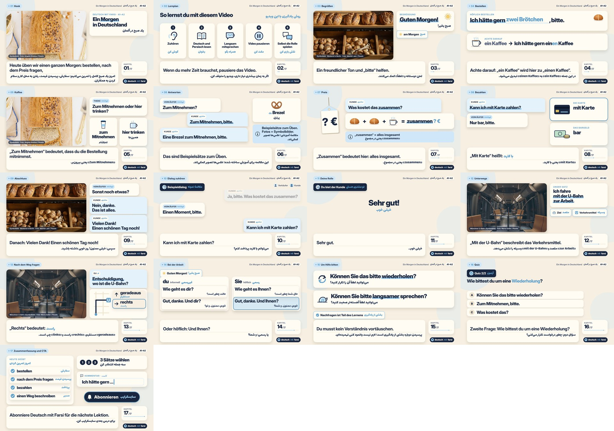

# QC-Bericht – Ein Morgen in Deutschland (weekly)

Automatisch erzeugt von `scripts/qc.py` aus `out/final.mp4` (md5 `93002a03e442660ce54d5d8df06ea825`, 181.7 MB).

## Technik

| Prüfpunkt | Soll | Ist | OK |
|---|---|---|---|
| Auflösung | 1920×1080 | 1920×1080 | ✅ |
| Bildrate | 30 fps | 30/1 | ✅ |
| Dauer | 10:00 (±10 %) redaktionell | 7:32.10 | ⚠️ siehe Abweichungen |
| Video-Codec | H.264 High, yuv420p, CRF 17–19 | h264 High, yuv420p, CRF 18 | ✅ |
| Audio-Codec | AAC 256k, 48 kHz Stereo | aac 256k, 48000 Hz, 2 ch | ✅ |
| +faststart (moov vorne) | ja | ja | ✅ |
| Lautheit integriert | −14 … −16 LUFS | -15.1 LUFS (LRA 2.7 LU) | ✅ |
| True Peak | ≤ −1.5 dBTP | -2.0 dBTP | ✅ |
| Musik unter Sprache | 14–18 dB leiser | 15.5 dB (Stimme -16.1 / Musik -31.6 LUFS) | ✅ |
| Ducking | 150 ms Attack / 400 ms Release | wie Soll (one-pole, `audio/mix.py`) | ✅ |
| Fotoanteil | 25–40 % der Bildzeit | 35 % | ✅ |

## Sprache und Didaktik

- Stimme: Piper TTS `de-thorsten-low` (männlich, 16 kHz → 48 kHz). Erklärtempo length_scale 1.12, Lernsätze 1.15 → langsame Wiederholung 1.6 → 4 s Nachsprechpause.
- Langsame Wiederholungen: 10 (alle 10 Sätze aus `LEARNING_CUES.json`, je einmal an der passenden Lehrszene), erfasst in `voice_manifest.json`.
- Antwortpausen mit Countdown: 5 (3 im Rollenspiel, 2 im Quiz, je 5 s).
- Persische Wörter im deutschen Sprechtext: nicht gesprochen (deutsche Stimme), sondern eingeblendet – betrifft „Mit Karte heißt …“, „Bar heißt …“, „Geradeaus/Rechts/Links bedeutet …“. TTS-Eingaben mit arabischer Schrift: 0.
- Sprecherbezeichnungen „Verkäufer:/Kunde:“ im Dialog werden als Beschriftung gezeigt, nicht gesprochen (Briefing: Unterscheidung durch Beschriftung und Pausen).
- Untertitel: `de.srt` (132 Einträge) und `fa.srt` (95 Einträge) aus gemessenen Audio-Zeitmarken.

## RTL / Persisch

- Schrift Lalezar (OFL) aus der Master-Vorlage; Formung und Bidi durch Chromium (HarfBuzz), `direction: rtl` für alle persischen Blöcke; gemischte Zeilen (z. B. «Zum Mitnehmen» یعنی …) visuell geprüft.
- ZWNJ (U+200C) in den Übersetzungen erhalten: 70 Vorkommen (z. B. می‌خواهم, بیرون‌بر, همین‌جا).
- `fa.srt` mit RLE/PDF-Steuerzeichen um jede Zeile, damit Player mit LTR-Standard korrekt darstellen.
- Ergänzte persische Übersetzungen (im Paket nicht 1:1 vorhanden, für Satzgleichheit ergänzt, bitte gegenlesen):
  - weekly_02: „Wenn du mehr Zeit brauchst, pausiere das Video.“ → اگر به زمان بیشتری نیاز داری، ویدیو را متوقف کن.
  - weekly_03: „Diese Begrüßung passt am Morgen.“ → این سلام برای صبح مناسب است.
  - weekly_07: „Du möchtest den Preis wissen.“ → می‌خواهی قیمت را بدانی.
  - weekly_08: „Die Antwort kann ja oder nein sein.“ → پاسخ می‌تواند بله یا نه باشد.
  - weekly_08: „Mit Karte heißt:“ → «mit Karte» یعنی با کارت.
  - weekly_08: „Bar heißt:“ → «bar» یعنی نقدی.
  - weekly_09: „Du musst nicht alle Sätze auf einmal sagen.“ → لازم نیست همهٔ جمله‌ها را یک‌جا بگویی.
  - weekly_10: „Höre jetzt unser ganzes Beispiel.“ → حالا کل مکالمه را گوش کن.
  - weekly_10: „Guten Morgen! Was möchten Sie?“ → صبح بخیر! چه می‌خواهید؟
  - weekly_10: „Guten Morgen! Ich hätte gern zwei Brötchen und einen Kaffee, bitte.“ → صبح بخیر! لطفاً دو نان کوچک و یک قهوه می‌خواهم.
  - weekly_10: „Zum Mitnehmen?“ → بیرون‌بر؟
  - weekly_10: „Ja, bitte. Was kostet das zusammen?“ → بله، لطفاً. همه با هم چقدر می‌شود؟
  - weekly_10: „Einen Moment, bitte.“ → یک لحظه، لطفاً.
  - weekly_10: „Ja. Sonst noch etwas?“ → بله. چیز دیگری هم می‌خواهید؟
  - weekly_11: „Ich stelle die Fragen.“ → من سؤال می‌پرسم.
  - weekly_11: „Sehr gut.“ → خیلی خوب.
  - weekly_11: „Ich hätte gern zwei Brötchen und einen Kaffee, bitte.“ → لطفاً دو نان کوچک و یک قهوه می‌خواهم.
  - weekly_12: „Heute fahren wir mit der U-Bahn.“ → امروز با مترو می‌رویم.
  - weekly_13: „Entschuldigung ist ein höflicher Einstieg.“ → «Entschuldigung» شروعی مؤدبانه است.
  - weekly_15: „Diese beiden Sätze helfen dir in vielen Gesprächen, nicht nur bei der Arbeit.“ → این دو جمله در بسیاری از گفت‌وگوها کمکت می‌کنند، نه فقط سر کار.

## Bilder und Lizenzen

| Datei | Quelle | Lizenz | Einsatz / Beschriftung im Video |
|---|---|---|---|
| bakery.jpg | Manish Jain / Pexels (30853707) | Pexels License | Szenen 3, 9 · „Symbolbild · Bäckerei in Berlin“ |
| bread_coffee.jpg | Angela Khebou / Pexels (14003973) | Pexels License | Szenen 1, 5 · „Symbolbild“ (kein Ort behauptet) |
| metro_interior.jpg | Maria Geller / Pexels (2799586) | Pexels License | Szenen 12, 13 · „Münchner U-Bahn (Symbolbild)“ |

- Keine KI-Fotos, keine Stock-Personen animiert, keine Texte über detailreichen Fotoflächen (Text immer in eigenen Karten neben dem Foto).
- Kein 4K-Upscaling; Fotos werden in einer 1000×612-Karte gezeigt (Ken Burns 1.00→1.06 je 8 s).
- Alle Illustrationen sind eigene SVGs (`src/icons.js`, Brezel aus `lib.js` der Master-Vorlage).
- Stimme: `voice/MODEL_CARD` nennt als Datensatz Thorsten-Voice, Lizenz CC0; Piper selbst ist Open Source. Keine pauschale Lizenzfreiheit behauptet – vor Veröffentlichung bitte die aktuelle Lizenzangabe des Modells prüfen.
- Musik/Effekte: eigene Synthese in `audio/music.py`, keine Samples.

## Abweichungen vom Briefing (transparent)

1. **Dauer 7:32.10 statt 10:00.** Gemessen nach der Synthese: Der vollständige Sprechtext aus SCRIPT.md ergibt mit Piper bei 1.12 inkl. aller Wiederholungen, Nachsprech- und Antwortpausen diese Länge. Das Briefing verbietet Fülltexte und künstliche Dehnung, daher wurde nicht gestreckt. Kapitel und SRT basieren auf den echten Zeiten.
2. Persische Wörter im deutschen Sprechtext werden eingeblendet statt gesprochen (s. o.).
3. Sprecherbezeichnungen im Dialog werden nicht vorgelesen.

## Screenshots (aus final.mp4)

- [01 Hook](qc/frame_01.jpg) @ 0:12.58
- [02 Lernplan](qc/frame_02.jpg) @ 0:30.58
- [03 Begrüßen](qc/frame_03.jpg) @ 0:54.31
- [04 Bestellen](qc/frame_04.jpg) @ 1:21.09
- [05 Kaffee](qc/frame_05.jpg) @ 1:47.48
- [06 Antworten](qc/frame_06.jpg) @ 2:13.00
- [07 Preis](qc/frame_07.jpg) @ 2:38.62
- [08 Bezahlen](qc/frame_08.jpg) @ 3:07.67
- [09 Abschluss](qc/frame_09.jpg) @ 3:37.34
- [10 Dialog zuhören](qc/frame_10.jpg) @ 4:04.24
- [11 Deine Rolle](qc/frame_11.jpg) @ 4:41.02
- [12 Unterwegs](qc/frame_12.jpg) @ 5:11.66
- [13 Nach dem Weg fragen](qc/frame_13.jpg) @ 5:42.73
- [14 Bei der Arbeit](qc/frame_14.jpg) @ 6:07.28
- [15 Um Hilfe bitten](qc/frame_15.jpg) @ 6:30.88
- [16 Quiz](qc/frame_16.jpg) @ 7:01.41
- [17 Zusammenfassung und CTA](qc/frame_17.jpg) @ 7:25.87
